# [Group 3] Personal Key Indicators of Heart Disease
Key Indicators of Heart Disease
2020 annual CDC survey data of 400k adults related to their health status

## Contributors
|組員|系級|學號|工作分配|
|-|-|-|-|
|周正晏|資科碩專一|111971003|data analysis、model traning(XGBoost)| 
|施宗佑|資科碩專一|111971005|data analysis、model traning(XGBoost)| 
|楊昇豐|資科碩專一|111971013|負責data、model、evaluation；也是資料集提供者|
|謝弘軒|資科碩專一|111971022|Readme edit、 Report edit| 
|郭書瑋|資科碩專一|111971023|data analysis、model traning(隨機森林)| 
|胡元亨|資科碩專一|111971024|data analysis、model traning(隨機森林)| 


## Document position
我們將專案進行過程中的文件放在資料夾docs底下，有以下幾份關於本次專案的文件：
  * 簡報.pdf
  * 簡報草稿.pdf
  * 討論紀錄.pdf
## 如何執行專案
### 各程式執行語法
* Install the required packages
    ```
    Rscript code/library.R
    ```
* 使用不同模型執行預測，產生各模型預測結果
    ```R
    # 決策樹(預估3~6分鐘)
    Rscript code/main.R --data_source 1 --model 1
    # 隨機森林(預估2~5分鐘)
    Rscript code/main.R --d 2 --m 2
    # XGBoost(預估1~2分鐘)
    Rscript code/main.R --d 2 --m 3

    ```
    參數:
    * --data_source or --d: 選擇使用的資料集(1: 原始資料, 2: 已處理後資料)
    * --model or --m: 選擇使用的模型(1: Decision tree, 2: Random forest, 3. XGBoost)
    
    提醒
    * 已處理後資料: 表示先經過Data process&smote切割後的資料集
    * Decision tree: 不支援使用已處理後資料，且耗時較長
    
* 產生資料集數據分析圖
    ```
    Rscript code/data_plot.R
    ```
### Output説明
* main.R
    1. result.csv: 模型預測評估結果
    2. roc-13、roc-29: 不同Feature的AUC表現
* data_plot.R
    1. data_plot.pdf: 資料集分析圖檔
    
## About Dataset
* 樣本總數 :  共 319795 筆
* 目標欄位： 心臟病 Heart Disease (Yes or No )
* 數值型欄位資料：BMI、PhysicalHealth、MentalHealth、AgeCategory、SleepTime
* 類別型欄位資料：Smoking、AlcoholDrinking、Stroke、DiffWalking、Sex、Race、Diabetic、PhysicalActivity、GenHealth、Asthma、KidneyDisease、SkinCancer
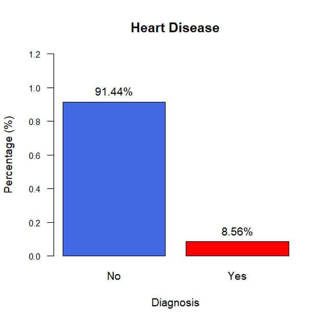
## 資料前處理
### 原始資料集的分析問題：NA、重複、特徵類型、不平衡
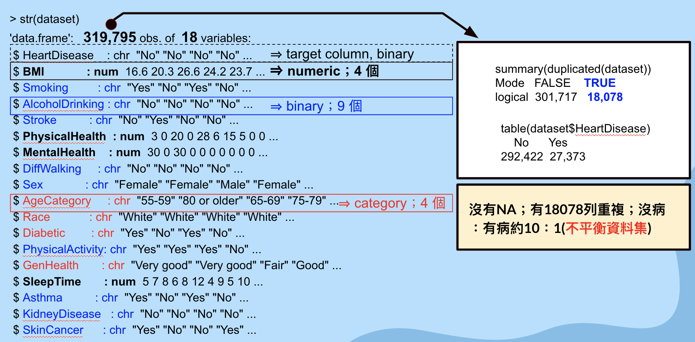
### 為了建模需要，進行如何的前處理
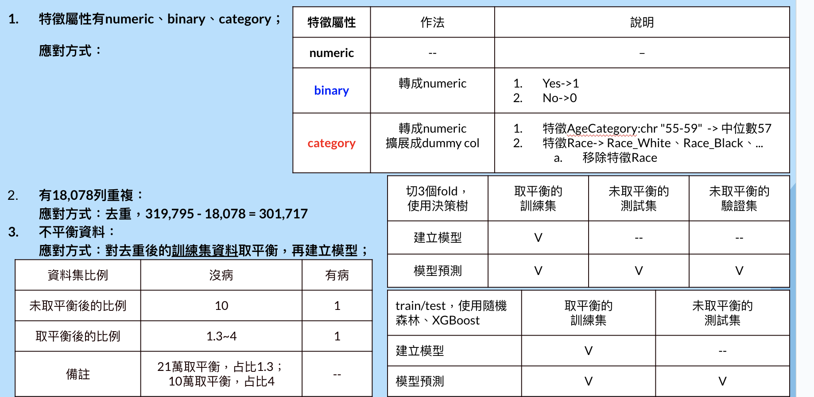
### 未處理、前處理後的資料集差異對照：
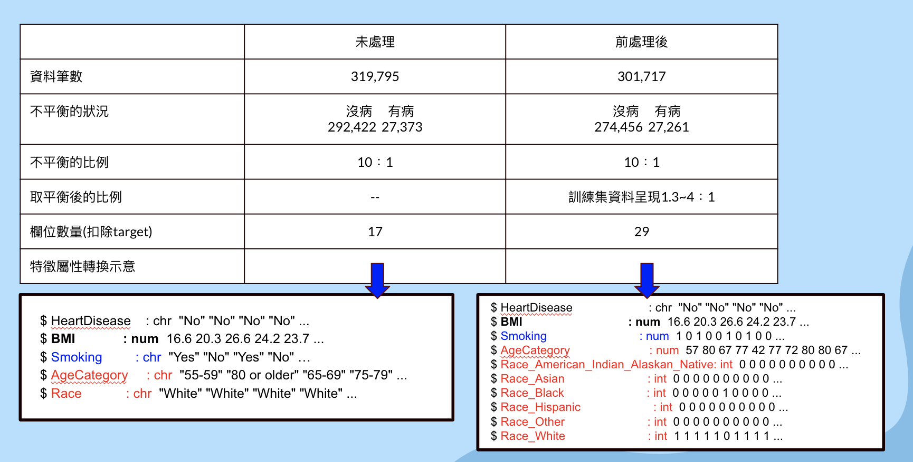
## 各模型的執行狀況
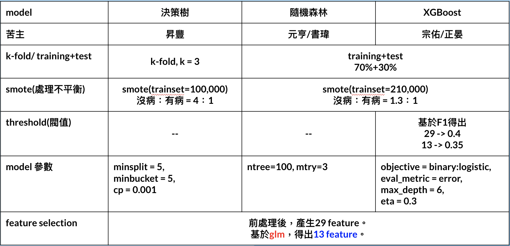
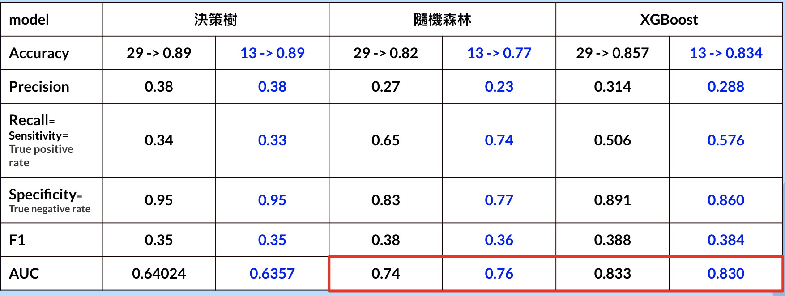
## 介紹最終建議方案
### 特徵工程 - chi-squre檢視欄位跟target HeartDisease的顯著性
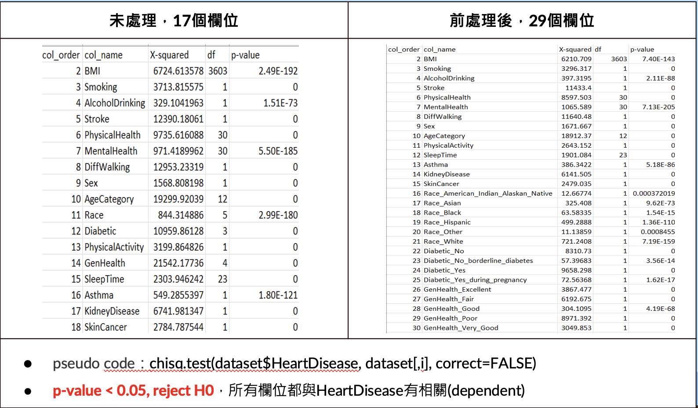
### 特徵工程 - 借助glm，得出欄位重要性、共線性
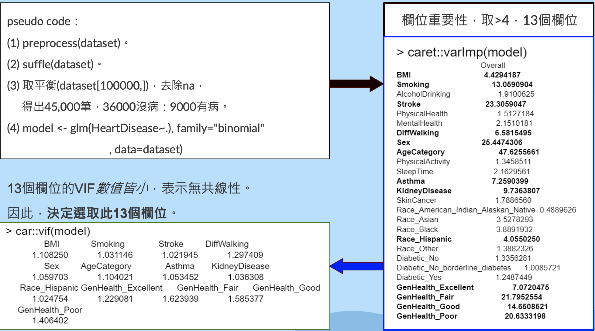

### 評估與結論
* 分析價值
  1. 確定無相關的特徵其實是重要的。
  2. 得出不具有共線性效果的特徵，既維持效能又提升建立模型的效率。
  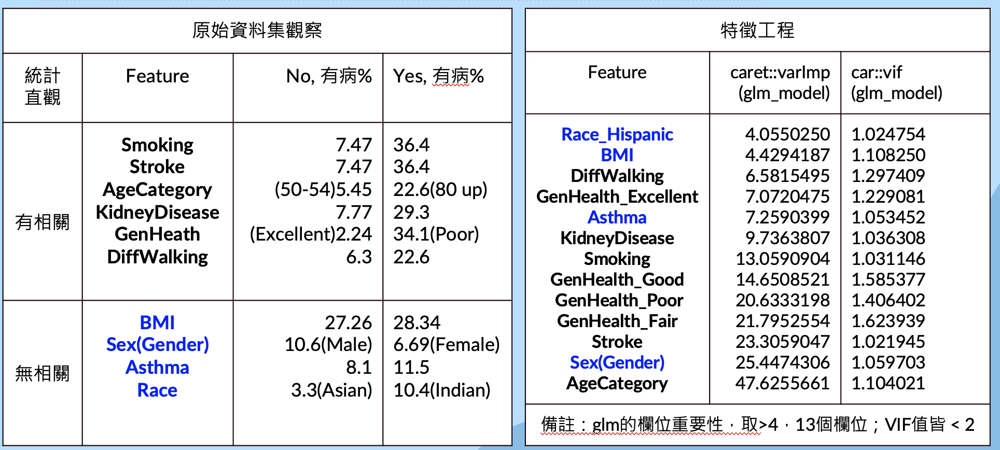
* 特徵工程選定13個有價值參數
  **BMI、Smoking、Stroke、DiffWalking、Sex、AgeCategory、Asthma、KidneyDisease、Race_Hispanic、GenHealth_Excellent、GenHealth_Fair、GenHealth_Good、GenHealth_Poor**
### 建議模型 - XGBoost
* 模型參數
  1. max_depth：樹的最大深度，使用max_depth=6。目的：數值愈大模型擬合度越高。
  2. eta：又稱為learning_rate，使用預設值0.3。目的：此參數用於防止over fitting。
  3. eval_metric = error ： 此為二進制分類錯誤率，預設使用0.5來判斷。目的：評估每回迭代的分類效果，公式「#(wrong cases) 除以 #(all cases)」
  4. binary:logistic： 羅吉斯回歸，model對每一筆預測資料輸出機率
  5. binary:hinge: 二元分類中使用hinge loss作為loss function進行分類，model對每一筆預測資料輸出2元結果(1, 0)
* threshold(閥值)選取方式
  1. 採用13個Feature，基於binary:logistic搭配不同threshold，產生三種評估指標。
  2. 已知資料集是不平衡(沒病：有病約10：1)，成功檢測出患者有病才是重要的。
  3. 若一味降低threshold提高Precision，會擴大沒病者判定為有病的情況，此是不樂見的。
  **Final Result: 綜合考量Precision and Recall的F1，在F1有最大值 = 0.3838，採取threshold = 0.35進行建模。**
  
* 建模後對test資料集的預測結果
  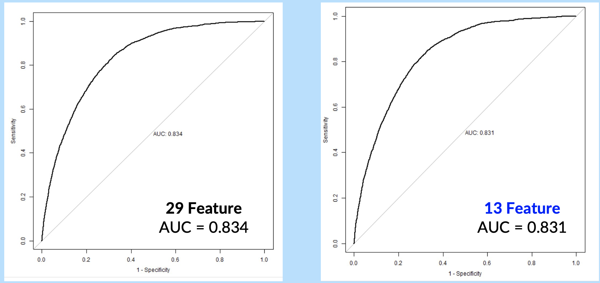
### 建議模型 - 隨機森林
* 模型參數
  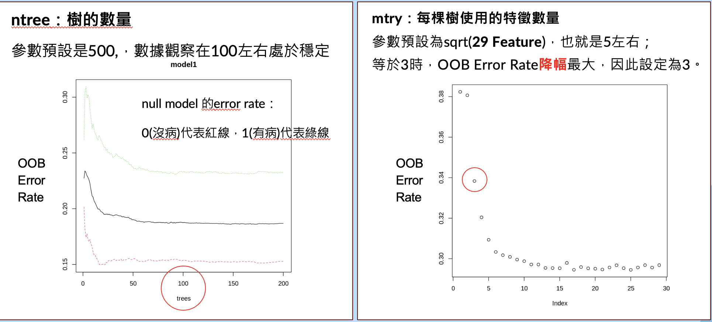
  (out of bag)OOB： random forest 採樣時，沒被採樣到的資料。
  利用沒被選到的資料進行模型的驗證評估，得出OOB error rate = 1 - (OOB data猜對數量 / (OOB data全部數量))

  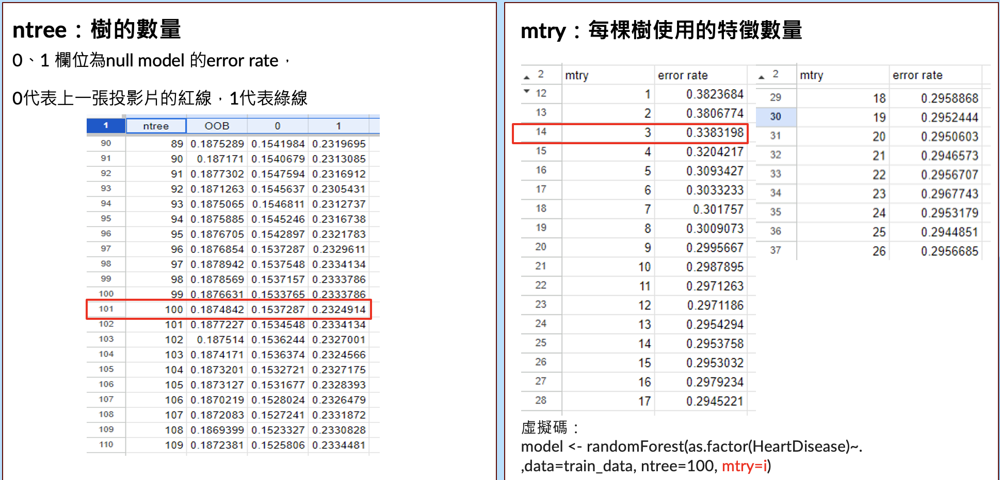
  [更多數值](https://docs.google.com/spreadsheets/d/1IM2-4hOuFyP3FJt-YIv7QdDRmdFKmODZmsDmDpPo974/edit#gid=1549750515)
* 建模後對test資料集的預測結果
  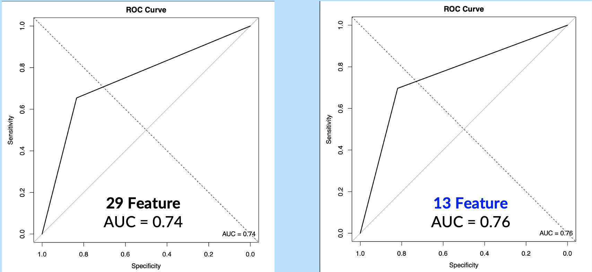

## 外部資料
* kaggle dataset

    [(example)Hux.DA5030.Project | Kaggle](https://www.kaggle.com/code/karenhu8/hux-da5030-project)
    
    [(example)STAT 451 Project | Kaggle](https://www.kaggle.com/code/charleshwang/stat-451-project)
    
    [(example_explaindata)Heart Disease Scoring : Who is dangerous 🤔? | Kaggle](https://www.kaggle.com/code/jaewook704/heart-disease-scoring-who-is-dangerous)
    
    [(example_explaindata)Heart Disease Prediction | Kaggle](https://www.kaggle.com/code/andls555/heart-disease-prediction)
* smote

    [(performanceEstimation)imbalanced data - package to do SMOTE in R - Stack Overflow](https://stackoverflow.com/questions/67085791/package-to-do-smote-in-r)
* VIF

    [(glm_Variable Importance_VIF)How to Perform Logistic Regression in R (Step-by-Step) - Statology](https://www.statology.org/logistic-regression-in-r/)
    
    [(multicollinearity)How to Fix in R: there are aliased coefficients in the model - Statology](https://www.statology.org/r-aliased-coefficients-in-the-model/)
* AUC

    [Interpreting ROC Curve and ROC AUC for Classification Evaluation | by Vinícius Trevisan | Towards Data Science](https://towardsdatascience.com/interpreting-roc-curve-and-roc-auc-for-classification-evaluation-28ec3983f077)